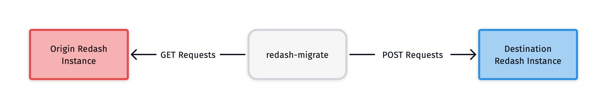

redash-migrate - Move data from one instance of Redash to another


- [INSTALLATION](#installation)
- [DESCRIPTION](#description)
- [METAFILE](#meta.json)
- [COMMANDS](#commands)
- [FAQ](#faq)
- [DEVELOPER INSTRUCTIONS](#developer-instructions)
- [BUGS](#bugs)
COPYRIGHT

## INSTALLATION

To install it you will need Python 3.6 or above. We recommend that you use a [virtual environment](https://pythonbasics.org/virtualenv/). The `redash-migrate` command is part of our Python API wrapper, called `redash-toolbelt`.

```bash
pip install --upgrade redash-toolbelt
```

This command will update `redash-toolbelt` if you have already installed it. See the [PyPi page](https://pypi.org/project/redash-toolbelt/) for more information. The `redash-migrate` command will now be available. Run

```bash
redash-migrate --version
```

to verify your installation.

## DESCRIPTION

**redash-migrate** is a command-line program to move data from one Redash instance to another . It requires the Python interpreter, version 3.6+, and it is not platform specific. It should work on your Unix box, on Windows or on macOS. It is released to the public domain, which means you can modify it, redistribute it or use it however you like.

```bash
redash-migrate [COMMAND]
```
## METAFILE

`redash-migrate` uses a file called `meta.json` to track its state between command executions. And it updates `meta.json` after each command executes. 

```bash
redash-migrate init
```

This command creates a `meta.json` file in your working directory. Before you run further commands, you must fill-in the `settings` object:

```json
"settings": {
    "origin_url": "",
    "origin_admin_api_key": "",
    "destination_url": "",
    "destination_admin_api_key": "",
    "preserve_invite_links": true
}
```
<div style="background: #F7F9F9;  border-left: 5px solid #d44946;  padding: 1em; display: flex; flex-flow: row nowrap; align-items: center; gap: 2em; margin-right: auto">
    <span style="font-size: 30pt">⚠️</span>
    <p style="margin: auto; ">Do not share your <code>meta.json</code> file with anyone. It contains administrator API keys for your Redash instance. This information is private. If you do share it, reset the API keys for your Redash instances immediately.</p>
</div>

### SETTINGS
```text
origin_url              The base URL for your origin Redash instance. For example:
                        https://app.redash.io/acme
origin_admin_api_key    The api key for an admin user on your origin instance.
destination_url         The base URL for your destination Redash instance. For example:
                        http://localhost
preserve_invite_links   Whether or not to write user invitation links into meta.json. If false,
                        users logging-in to the destination instance for the first time will need
                        to click the "I forgot my password" link to receive an email. If true,
                        invite links will be written to meta.json. These links can be used to set a
                        new password directly without using the forgotten password workflow. The
                        default value is true.
```

## COMMANDS

```text
init                  Create a meta.json template file in your working directory. You must 
                      populate the `settings` object within meta.json before proceeding.
data_sources          Create stubs of your origin data sources in your destination instance
check_data_sources    Compare the data sources in your origin and destination instances
groups                Duplicate group names, member lists, and data source permissions from 
                      the origin instance into the destination instance.
destinations          Create stubs of your origin alert destinations in your destination
                      instance
users                 Duplicate user names, emails, and enabled/disabled status from the
                      origin instance into the destination instance.
queries               Duplicate queries from the origin instance to the destination instance.
                      Skips queries with an unknown destination data source or user.
visualizations        Duplicate visualizations from the origin instance to the destination
                      instance. Only duplicates visualizations for queries moved by the
                      `queries` command.
dashboards            Duplicate dashboards from the origin instance to the destination
                      instance. Skips any dashboard widget whose visualization was not moved
                      using the `visualizations` command.
alerts                Duplicate alert definitions from the origin instance to the destination
                      instance. Skips alerts that point to queries that were not migrated by
                      the `queries` command. Run the `destinations` command first.
favorites             Duplicate favorite flags on queries and dashboards from the origin 
                      instance to the destination instance.
disable_users         Disable users in the destination instance that are disabled in the
                      origin instance.
```


----------------------

For a video version of this document, click [here](#link-to-youtube-video).

### _Outline_
- Intended users
- Background
- How does it work

## Acknowledgements

Huge thanks to those who have contributed to and beta tested this script, including: 

This document is inspired by the README for [youtube-dl](https://github.com/ytdl-org/youtube-dl).

### _Subheadings_





## Setup


## Running the migration


### Re-running individual steps


## FAQ

### I found a different script online, why should I use yours instead?

This migration script is the only one we can support. We wrote it because the previous migration script would no longer work reliably on newer versions of Redash (since V7). You can use any script you want to migrate from one instance to another. But we recommend this one for ease-of-use and because it has been tested by many members of the Redash community.
- How can I back up my app.redash.io data


### How can I back-up my Hosted Redash data?

